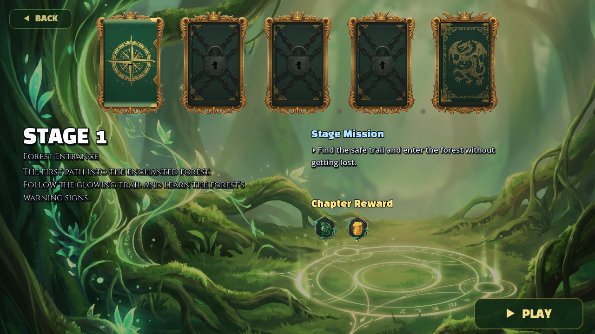
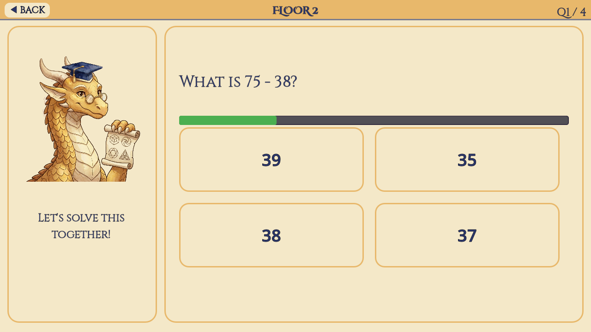

# DragonMagic

[](https://github.com/notaa135/dragonmagic/actions/workflows/verify.yml)

**An educational RPG prototype built through AI-assisted development and evidence-based review.**

DragonMagic connects math and English practice with an adventure: choose a stage, answer a question, and progress through a fantasy world. I use this personal project to turn product requirements into working screens, review AI-assisted changes, and decide what evidence is needed before accepting them.



*Actual Godot runtime capture, May 18, 2026. Stage selection shows progression, a mission, and chapter rewards.*

## My contribution

- Define user flows, learning constraints, and concrete acceptance criteria.
- Coordinate AI-assisted implementation with ChatGPT, Claude, and Codex.
- Compare rendered screens and interaction behavior with the requested result.
- Request corrections when a completion claim lacks the evidence needed to support it.
- Maintain review notes, test checkpoints, and a clear distinction between working features and design proposals.

Godot 4.6.1 and GDScript support the prototype. My emphasis is product direction, workflow design, and verification alongside AI-assisted implementation.

## What you can inspect

| Evidence | What it shows |
|---|---|
| [Runtime gallery and progress](docs/PROGRESS.md) | Stage selection, the hub, and math practice |
| [Verification record](docs/VERIFICATION.md) | Executable learner-profile checks and dated project evidence |
| [Regression case study](docs/CASE_STUDY.md) | Why an apparently safe cleanup broke stage navigation |
| [Learner-profile source sample](src/profile_resolver.gd) | Explicit rules for hints, timing, difficulty, and fallback behavior |
| [Repository scope](docs/SCOPE.md) | Source provenance and what this public selection includes |

## Run the public checks

With [Godot 4.6.1](https://github.com/godotengine/godot-builds/releases/tag/4.6.1-stable) on your path, run from this repository:

```bash
godot --headless --path . --script res://tests/profile_resolver_test.gd
```

**Latest local result: 31 passed, 0 failed** on September 13, 2026. The checks exercise the unchanged source sample using synthetic profiles: fallback behavior, default selection, timing, hints, difficulty, and explicit settings. No original quiz data or accounts are needed. A GitHub Actions workflow runs the same command on pushes and pull requests.

## Learning flow



*Actual Godot runtime capture, May 18, 2026. A math question presents four answer choices and visible progress.*

The prototype contains stage selection, quiz-based battle logic, separate math practice, and result screens. The last recorded development focus was a short W1-5 boss-battle slice and more consistent visual presentation. Later UI and motion experiments remain separate from the implemented game.

## A useful review lesson

A scene cleanup removed nodes that looked unused in a text search. The scene still referenced them through names assembled at runtime, so stage navigation failed. The project record documents the failure, the reversal, and a successful follow-up check across 14 scenes. [Read the case](docs/CASE_STUDY.md).

That is the standard I aim for: a change is ready when the relevant behavior has been checked and the result can be explained.

## Current status

**Personal prototype; selected public portfolio.** The latest preserved runtime screenshots are from May 2026. A September 13, 2026 data check validated 1,324 quiz items with zero schema errors or warnings. This repository presents selected evidence and a source sample; it is not the full game distribution.

Created by [Taeyoung Noh](https://github.com/notaa135).
