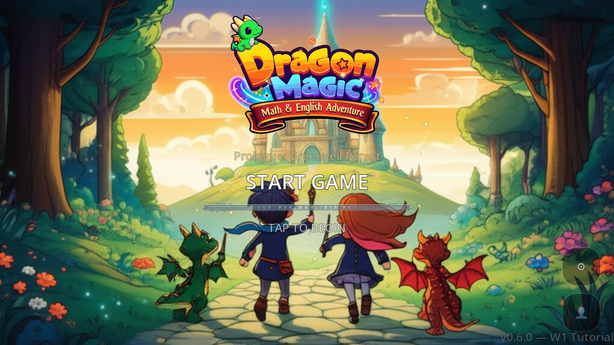
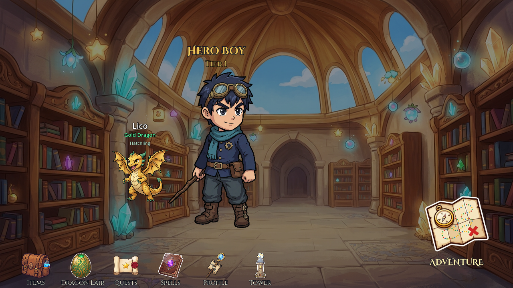

# Progress and runtime gallery

DragonMagic is a personal educational RPG prototype. This page separates implemented work from later design exploration.

## Recorded milestones

| Date | Progress | Evidence boundary |
|---|---|---|
| April 2026 | Project records describe W1 stage flow, quiz-based battles, results, and save/resume support. | Historical development records; no new complete playthrough was performed for this portfolio. |
| May 2, 2026 | A stage-selection regression was reproduced and reversed; the follow-up smoke check passed across 14 scenes. | Scene instantiation and error checks, not full gameplay coverage. |
| May 17, 2026 | The UI review handoff recorded the title screen in Godot. | Direct runtime capture, selected as the portfolio's main image. |
| May 18, 2026 | Godot runtime captures recorded the hub, stage selection, battle, math practice, and results. | Selected actual captures appear below. |
| May 23, 2026 | A focused battle UI and motion review package was prepared. | Test-only design evidence; production integration was still pending. |
| September 13, 2026 | The quiz-data validator passed for 1,324 items with zero errors and warnings. | Schema and consistency checks; see the verification record. |
| September 13, 2026 | The public learner-profile sample passed 31 fresh checks in Godot 4.6.1. | Synthetic fixtures exercise component behavior; no full-game test is implied. |

## Begin the adventure

The title screen introduces DragonMagic's math and English adventure with the logo, fantasy setting, and start action. This is the May 17, 2026 runtime capture selected as the main portfolio image.

## Choose an adventure

The stage screen presents a mission, rewards, progression locks, and the next action.

## Return to the hub

The hub connects the character and companion with inventory, spells, profile, learning, and adventure entry points.

## Practice a skill

The math screen keeps the question, four choices, and session progress visible.

All four images are unmodified 1280 × 720 runtime captures from May 17–18, 2026. The title comes from the UI review handoff; the other three were collected through Godot MCP scene playback and viewport capture. Some scenes were opened directly for inspection; the gallery is not a recorded end-to-end playthrough.

## Last recorded development direction

The May records focus on a short W1-5 boss-battle sequence with clearer separation between answering a question and selecting a spell. Visual consistency, animation, and interaction evidence remained open review areas. September work assembled this portfolio and added public component checks; it does not establish later gameplay development or completed mobile-device validation.
